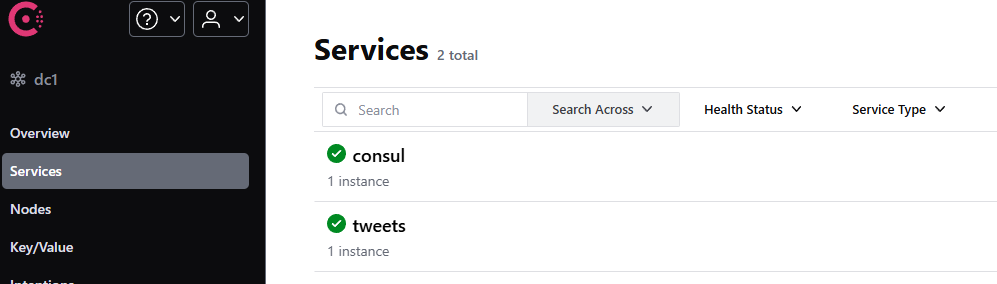
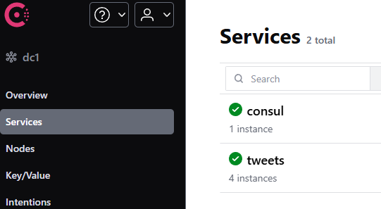

# Twitter like web application

Simple twitter like web app with CRUD to process tweets data.

# Evalable endpoints

| endpoint | what they do |
| ------ | ------ |
| localhost:8081/tweets/get | help you to retrive the data by id field from storage |
| localhost:8081/tweets/post | help you to post the new data inside the storage |
| localhost:8081/tweets/put | help you to update the existing data by id |
| localhost:8081/tweets/delete | help you to delete the data by id field |
| localhost:8081/tweets/list | help you to get all the data |
| localhost:8081/tweets/time | return current time, no more |


# Tech
Go, Git, http/net, sync, context, go mod, 

# Install and run

- Download the application: 
```sh
git clone git@github.com:stevenstr/tweets_app_reforged.git
```
- Install the hashicorp/consul
- run the consul
```sh 
consul agent -dev -ui
```
- Go to the application directory:
```sh
cd tweets_app_reforged\tweets\cmd\
```
- Run micriservice using the following command:
```sh
go run main.go
```

- go to
```sh
http://localhost:8500/ui/dc1/services
```



- Run some new micriservice instances using the following command:
```sh
go run main.go --port 8082
go run main.go --port 8090
go run main.go --port 8086
```

- check that consul can see them
```sh
http://localhost:8500/ui/dc1/services
```


# Usage
## Post the data
 ```sh
curl --location --request POST 'localhost:8081/tweets/post?id=1&message=I_am_giorgio'
curl --location --request POST 'localhost:8081/tweets/post?id=2&message=I_am_PEPE'
curl --location --request POST 'localhost:8081/tweets/post?id=3&message=SWAFFARD' 
```

### Get the data by id
```sh
curl --location 'localhost:8081/tweets/get?id=1'
```
{"message":"I am giorgio"}
```sh
curl --location 'localhost:8081/tweets/get?id=3'
```
{"message":"SWAFFARD"}

```sh
curl --location 'localhost:8081/tweets/get?id=4'
```
null

### Get the all data 
```sh
curl --location 'localhost:8081/tweets/list'
```
{"1":{"message":"I am giorgio"},"2":{"message":"I_am_PEPE"},"3":{"message":"SWAFFARD"}}


## Put the data
```sh
curl --location --request PUT 'localhost:8081/tweets/put?id=2&message=I_am_SERGANT' 
```
```sh 
curl --location 'localhost:8081/tweets/list'
```
{"1":{"message":"I_am_giorgio"},"2":{"message":"I_am_SERGANT"},"3":{"message":"SWAFFARD"}}


### Delete the data by id
```sh
curl --location --request DELETE 'localhost:8081/tweets/delete?id=1'
```
```sh
$ curl --location 'localhost:8081/tweets/list'
```
{"2":{"message":"I_am_SERGANT"},"3":{"message":"SWAFFARD"}}


### Get the current time
```sh
curl --location 'localhost:8081/tweets/time'
```
"Thu, 30 Jan 2025 14:03:43 MSK"

# License
- MIT License